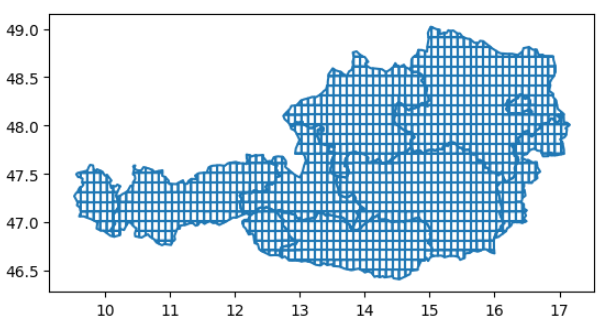

# grid-over-country
==============================

Create an equally spaced grid over a country.

Project Organization
------------

	├── README.md          <- The top-level README for developers using this project.
	├── Data
	│   ├── Raw            <- The original, immutable data dump.
	│   ├── Interim        <- Intermediate data that has been transformed.
	│   └── Processed      <- The final, canonical data sets for modeling.
	│
	├── Documents          <- Documents that are relevant for the project .
	│
	├── Images             <- Generated graphics and figures to be used in reporting.
	│
	├── Presentations      <- Files to present the project (ex: Powerpoint, PDF...)
	│
	├── requirements.txt   <- The requirements file for reproducing the analysis environment, e.g.
	│                         generated with `pip freeze > requirements.txt`
	│
	├── Scripts            <- Source code for use in this project.
	│
	└── Tests              <- Unit tests or experiments

------------
Author: FedericoGentile
